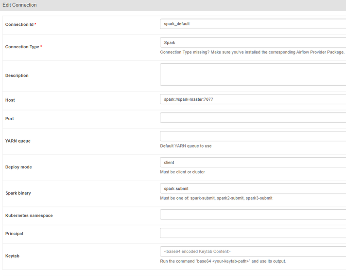

# 1. Spark 포트 지정.
## 1-1. batch/dags/daily_report_dag.py의 SparkSubmitOperator를 아래의 코드로 수정.
```python
    submit_spark_job = SparkSubmitOperator(
        task_id='spark_daily_report',
        application='/opt/airflow/dags/scripts/spark_daily_report.py',
        conn_id='spark_default',
        application_args=['--date', '{{ ds }}'], 
        conf={
            "spark.master": "spark://spark-master:7077",
            "spark.hadoop.mapreduce.fileoutputcommitter.algorithm.version": "2",
            "spark.driver.extraJavaOptions": "-Duser.dir=/opt/bitnami/spark"

        },
        verbose=True,
    )
```

## 1-2. Airflow connection을 아래와 같이 설정.


# 2. airflow로 파이프를 연결하기 위한 설정.
## 2-1. hadoop-namenode에 진입
```bash
docker exec -it hadoop-namenode /bin/bash
```

## 2-2. 필요한 경로에 HDFS 생성.
```bash
hadoop fs -mkdir -p /batch/data/realtime
hadoop fs -mkdir -p /batch/data/news_archive
hadoop fs -mkdir -p /batch/data/pdf
```

## 2-3. DAG 수행.

## 2-4. 수행 결과 확인
```bash
hdfs dfs -ls /batch/data/realtime
hdfs dfs -ls /batch/data/news_archive
hdfs dfs -ls /batch/data/pdf
```

## 2-5. 로컬에서 PDF 파일을 확인하기 위해 HDFS에서 현재 경로로 다운로드.
```bash
hdfs dfs -get /batch/data/pdf/daily_report_2025-05-26.pdf .
```
## 2-6. .gitignore
- log와 pycache 등을 제외.

# 3. 테스트 결과 확인
## 3-1. hadoop-namenode에 진입
```bash
docker exec -it hadoop-namenode /bin/bash
```

## 3-2. 생성된 pdf를 복사.
```bash
# 날짜를 잘 맞춰 주어야 함(docker hadoop-namenode)
hdfs dfs -get -f /batch/data/pdf/daily_report_2025-05-xx.pdf .
```

## 3-3. 복사한 pdf 파일 가져오기.
```bash
# 날짜를 잘 맞춰 주어야 함(powershell)
docker cp hadoop-namenode:/daily_report_2025-05-xx.pdf .
```